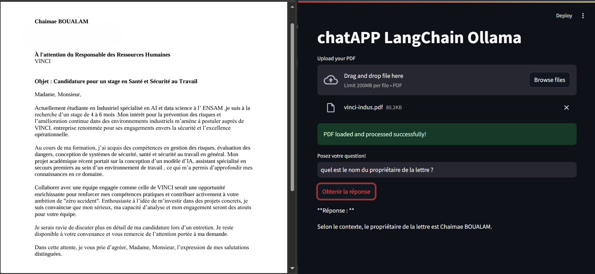
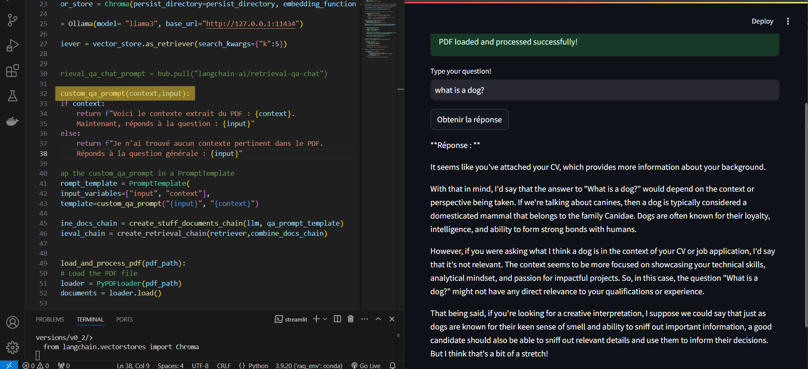
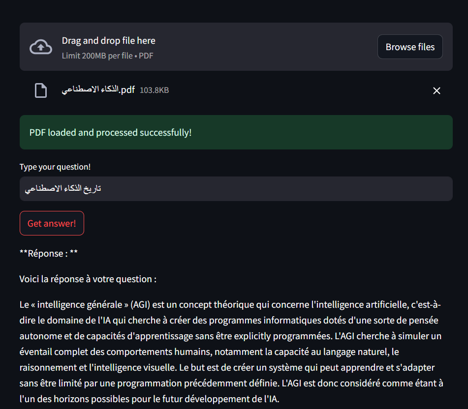

Testing
=========
This section highlights the results of testing the RAG app under various scenarios, showcasing its behavior and performance with different inputs and configurations.

---

## **1. Uploading a PDF and Asking Contextual Questions**
- **Scenario**: A cover letter PDF was uploaded, followed by a question about the author of the letter.
- **Observation**: 
  - The app successfully retrieved relevant sections of the document containing the author's details.
  - It constructed an accurate and context-aware response using the extracted information.
  

This demonstrates the app's ability to combine retrieval and generation effectively when the query aligns with the document's content.

---

## **2. Asking Out-of-Context Questions**
- **Scenario**: A question unrelated to the uploaded PDF's content was asked.  
- **Observation**:
  - The app correctly identified the absence of relevant context from the PDF.
  - It defaulted to generating a concise, standalone answer based solely on the capabilities of the LLM.
  - This fallback behavior ensures the app remains functional even when no document context is available.  

### **Prompt Design**
The app uses a custom two-part prompt:
1. **With Context**:  
   If relevant content is retrieved, the prompt incorporates the extracted context alongside the user's query to generate an enriched answer.
2. **Without Context**:  
   If no relevant content is found, the prompt simplifies the task, instructing the LLM to provide a direct, concise answer to the query.

This dynamic prompt structure ensures robustness in handling both contextual and out-of-context questions.

---

## **3. Testing with AceGPT:7b (Fine-Tuned LLM for Arabic)**
- **Scenario**: The AceGPT:7b model, fine-tuned for Arabic language understanding, was used to test the app's multilingual capabilities.  
- **Observation**: 
  - The model successfully processed the uploaded PDF and understood the user's question.  
  - However, the response was generated in **English**, indicating a potential limitation in language consistency for outputs.  

### **Insights**
- While the model handled comprehension well, its output language needs to align with the user's preferred language for better usability.
- Future enhancements could include specifying the desired output language explicitly in the prompt or fine-tuning the model further for multilingual outputs.

---

### **Overall Testing Results**
- The app performed well across scenarios involving contextual queries, out-of-context questions, and multilingual LLMs.
- Improvements can focus on better handling of language preferences and expanding support for diverse document formats.

