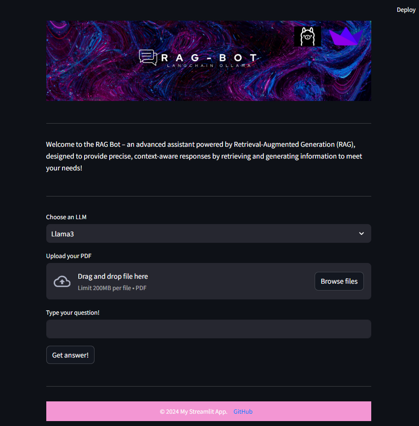

Usage
=====

______________________

1. **Upload a PDF Document**
Click on the "Upload your PDF" button to upload a file.
Supported file types: PDF.
The app processes the uploaded file by splitting it into chunks and storing it in the vector store (Chroma).

2. **Choose an LLM** (llama3 / mistral /AceGPT:7b) ,AceGPT:7b was finetuned on arabic content.
3. **Ask Questions**
Enter your question in the text input field.
Click the "Get answer" button to generate a response.

4. **View the Answer**
If the app retrieves relevant context from the PDF, the response is enriched with the extracted information.
If no relevant context is found, a short, direct answer is generated based on the LLM's capabilities.